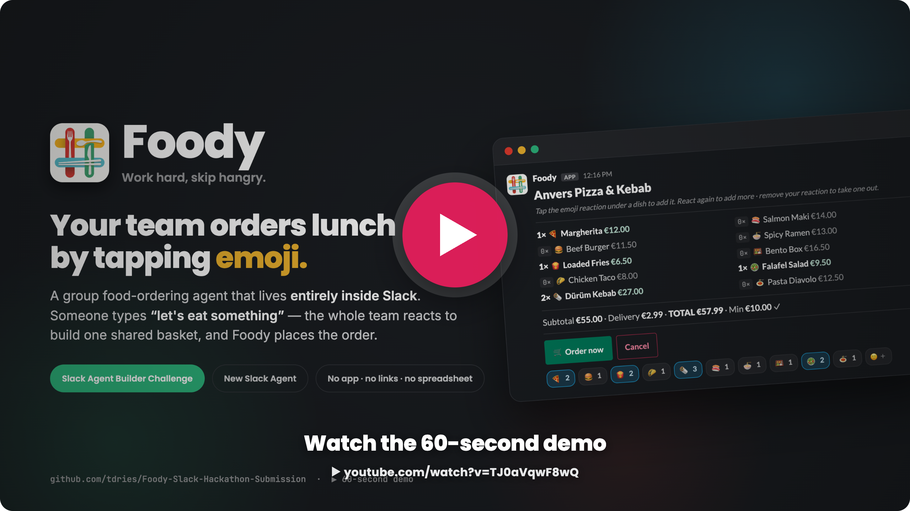
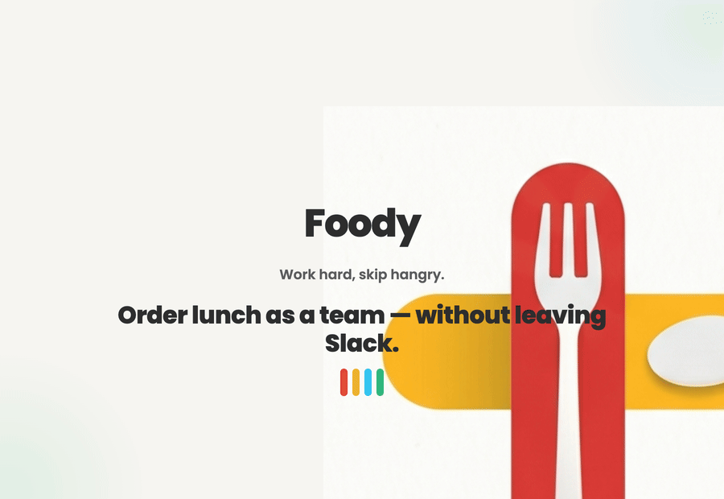
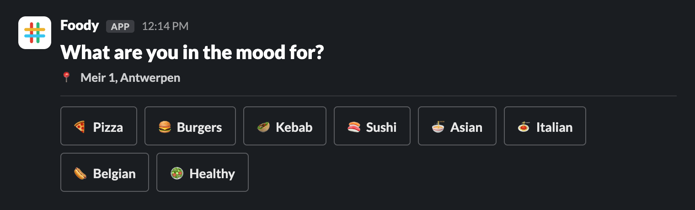
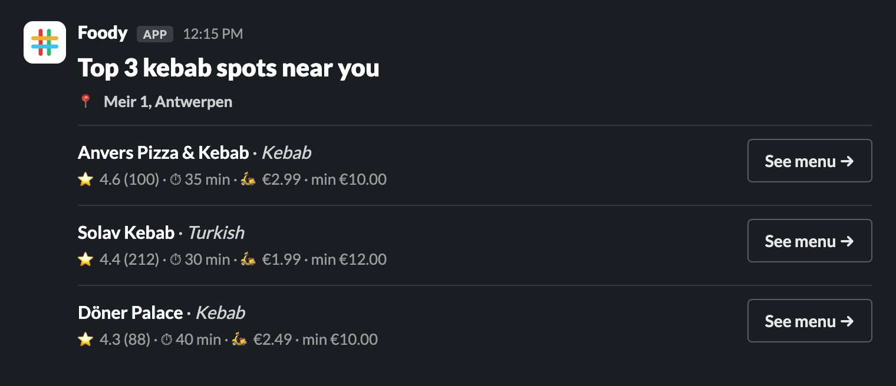
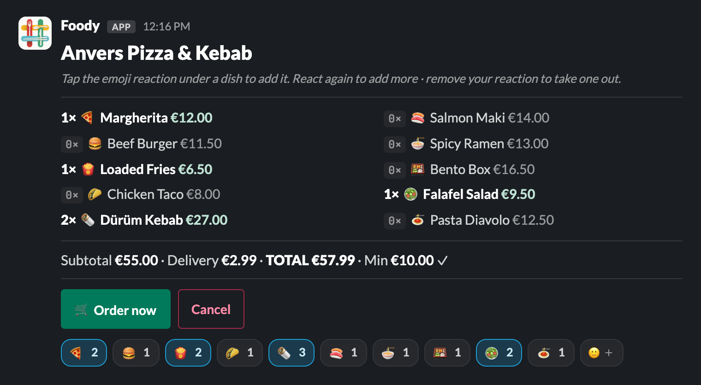
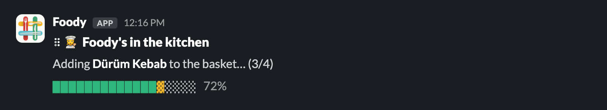
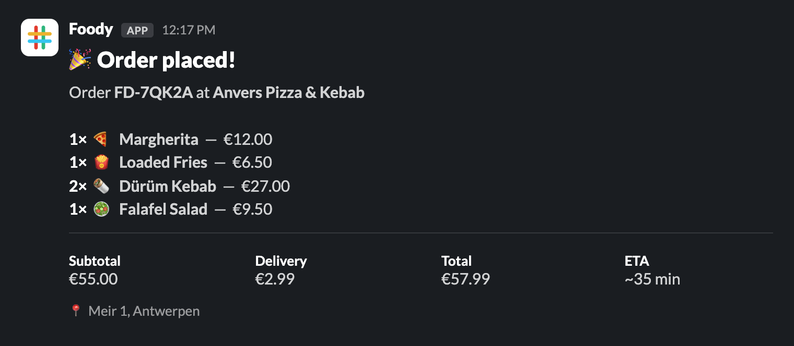
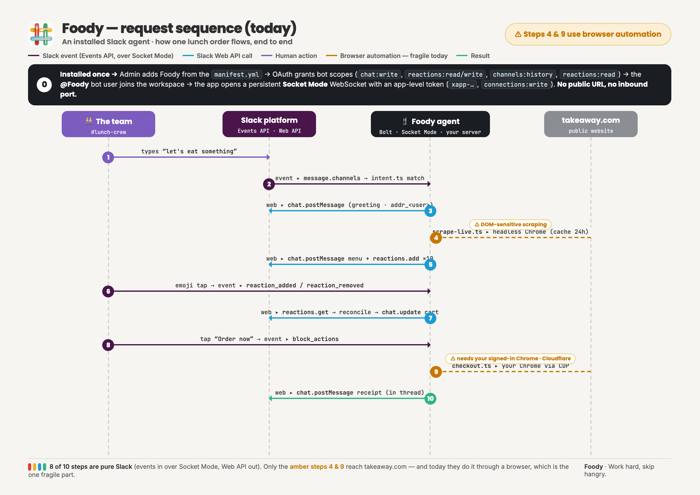
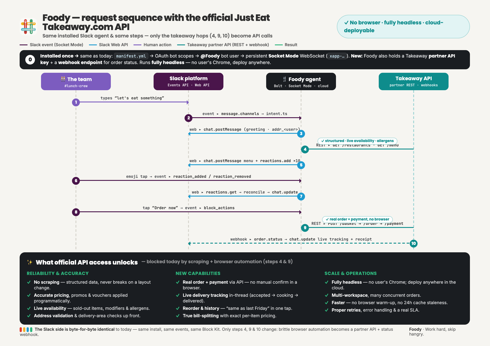
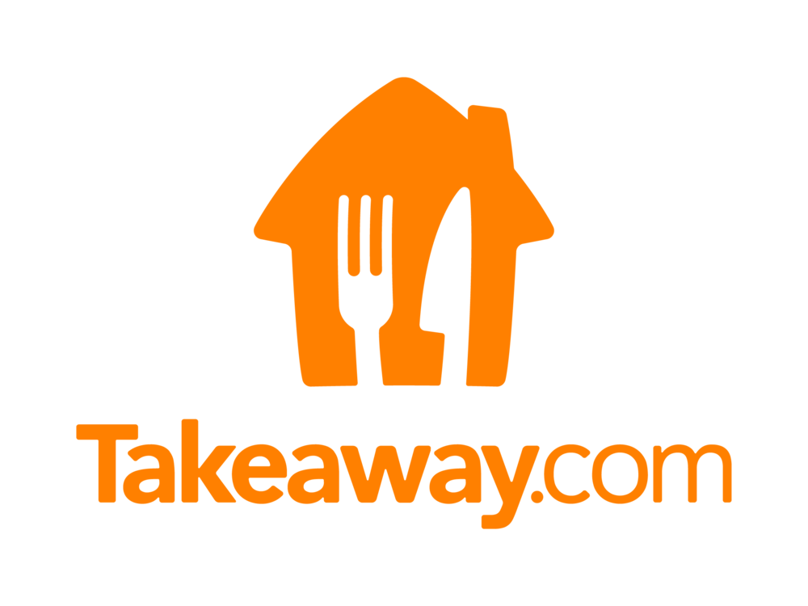

<div align="center">


&nbsp;

**A Slack-native group food-ordering agent that fronts Takeaway.com.**

Someone in your channel types **“let's eat something.”** Foody picks up, runs the whole order as a conversation, and builds one shared basket from everyone's emoji reactions.

<br>

[](https://github.com/tdries/Foody-Slack-Hackathon-Submission/actions/workflows/ci.yml)
[](LICENSE)


<br>

### 👉 See it live: Foody runs in the **[Foody developer sandbox](https://app.slack.com/client/E0BA2TY9PRR)** — open `#foody-demo` and type *“let's eat something”*, or ask the ✨ assistant.
*Judges (`slackhack@salesforce.com` · `testing@devpost.com`) have collaborator invites; sandboxes are invite-only, so everyone else: [watch the demo](https://www.youtube.com/watch?v=TJ0aVqwF8wQ) or email the maintainer for a seat.*  ·  full guide in **[DEMO.md](DEMO.md)**

<br>

<a href="https://www.youtube.com/watch?v=TJ0aVqwF8wQ"></a>

</div>

---

## Why Foody

Every team knows the thread. It's 12:14, someone posts *“lunch?”*, and twenty minutes vanish into scrolling menus, pasting links, copy-pasting orders into a DM, and one poor soul becoming the human spreadsheet who tallies it all and pays.

The food is easy. The **coordination** is the tax.

Foody removes it. The team is already in Slack, and Slack already has a universal, zero-learning-curve input device: the **emoji reaction**. So that's the entire interface. No app to install, no link to chase, no spreadsheet.

---

## The order flow

> A real run, start to finish. Five messages, one shared basket, one tap to order.

<div align="center">



</div>

### 1 · Someone says “let's eat something”
Foody greets the channel and confirms the delivery address. It's **sticky per Slack user** — asked once, remembered forever.


### 2 · Pick a vibe
Eight one-tap cuisine categories. Pick one (or skip straight to the top spots).



### 3 · Top 3 restaurants near you
Ranked and scored, each with rating, ETA, delivery fee and minimum — one tap to open the menu.



### 4 · React to build a shared basket
The top 10 dishes land as a **single live message** that Foody pre-reacts to. Anyone on the team taps an emoji to add a dish; un-reacting removes it. The running total updates in place for everyone.



### 5 · One tap to order
Hit the green button and Foody builds the basket on takeaway.com — with a live, self-animating progress card while it works.



### 6 · Done
A clean receipt lands in the thread: items, totals, and an ETA.



---

## 🤖 The AI assistant — built on Slack AI capabilities

Foody is a **Slack AI app**: it lives in the ✨ AI-apps split pane with a full assistant surface — **assistant threads, live status updates ("is scanning takeaway.com…"), and suggested prompts** — powered by Claude with tool use.

Open Foody from the AI-apps pane (or DM it) and just talk:

> *"Something spicy for 6 people under €15, we're at Veldstraat 1, 9000 Gent"*
> *"What are the top pizza spots near the office, and what does the best one charge for a margherita?"*
> *"Start a photo order for burgers in #foody-demo"*

The assistant compares restaurants, answers budget and menu questions, and remembers your delivery address. When you say go, it calls its `start_group_order` tool: the restaurant cards (or the menu, photos and all) land in the channel, and the classic emoji-reaction group flow takes over — **AI plans the order, the whole team fills the basket.**

| Slack AI capability | Where Foody uses it |
|---|---|
| Assistant surface (split pane) | The whole conversational ordering experience |
| Assistant threads & context | Multi-turn planning; knows which channel you came from |
| Live status | "is scanning takeaway.com…" while tools run |
| Suggested prompts | One-tap starters like *🍕 Feed the team* |
| Tool use (Claude) | `start_group_order`, restaurant search, address book |

---

## What makes it different

- **🪄 The interface is just emoji.** No forms, no webview — group ordering is reactions on a message.
- **🧭 Reactions are the source of truth.** The basket is reconciled from the *actual* reactions on the menu message, not a running tally of events — so a dropped Slack event never desyncs the cart. It self-heals.
- **🧠 AI where it helps, deterministic where it counts.** The assistant pane is Claude with tools — plan, compare, negotiate budgets in natural language. The moment an order starts, the flow is fully deterministic: phrase matchers, reactions, reconciliation. Same input, same result, no surprises mid-lunch.
- **🔌 Private by default.** Runs over Socket Mode — an outbound WebSocket, no public URL, nothing leaving the workspace.
- **🛒 A real checkout (opt-in).** Beyond the mock flow, Foody can drive an actual takeaway.com basket in *your* signed-in Chrome, ready to confirm.

---

## Architecture

Foody is a small TypeScript app. Each layer owns one thing:

| Layer | Responsibility |
|---|---|
| [`src/slack/app.ts`](src/slack/app.ts) | Bolt + Socket Mode app. Message triggers, action buttons, reaction events, every Block Kit post & update. |
| [`src/slack/blocks.ts`](src/slack/blocks.ts) | Block Kit builders: restaurant cards, the unified menu+cart card, the animated build-progress card, the receipt. |
| [`src/slack/assistant.ts`](src/slack/assistant.ts) | The Slack AI assistant: assistant threads, live status, suggested prompts, Claude tool-use, and the `start_group_order` bridge into the channel flow. |
| [`src/slack/intent.ts`](src/slack/intent.ts) | Phrase matchers for *“let's eat”*, *“order now”*, *“reset”*, *“change address to …”*. A list, not a model. |
| [`src/state.ts`](src/state.ts) | JSON state, keyed two ways: `addr_<user>` for the sticky address book, `sess_<channel>_<thread>` for the live cart. |
| [`src/takeaway.ts`](src/takeaway.ts) + [`src/scrape-live.ts`](src/scrape-live.ts) | Restaurant/dish lookup with an in-memory + 24-hour disk-TTL cache and a daily background prewarm. |
| [`src/checkout.ts`](src/checkout.ts) | Drives your already-running Chrome over the DevTools Protocol to fill the real basket in a background tab. |
| [`src/emojis.ts`](src/emojis.ts) | The dish-emoji pool and the Unicode ↔ Slack-shortcode mapping. |

```
✨ AI assistant (Claude + tools) ─ start_group_order ─┐
                                                      ▼
let's eat  →  intent  →  session state  →  discovery (scrape + cache)  →  pre-reacted menu
                                                                              │
                                              react / un-react  ───────────────┘
                                                     │
                                          reconcile cart from message reactions
                                                     │
                                            Order  →  build basket (your Chrome)  →  receipt
```

There's a one-page visual of this in **[docs/Foody-Technical-One-Pager.pdf](docs/Foody-Technical-One-Pager.pdf)**.

### Request sequence

How one lunch order flows end to end. Foody is an installed Slack agent: it connects over **Socket Mode** (no public URL), so most steps are pure Slack — events in, Web API calls out. Only the takeaway hops differ between today and the future.

**Today** — discovery and checkout go through browser automation (amber steps 4 & 9):



**With the official Just Eat Takeaway.com API** — the Slack side is identical; the brittle browser steps become a partner API + a status webhook, and it runs fully headless:



> Print versions: **[Architecture — Today (PDF)](docs/Foody-Architecture-1-Today.pdf)** · **[Architecture — With official API (PDF)](docs/Foody-Architecture-2-With-API.pdf)**

---

## Quick start

```bash
npm install
cp .env.example .env
# fill in SLACK_BOT_TOKEN, SLACK_APP_TOKEN, SLACK_SIGNING_SECRET
# + ANTHROPIC_API_KEY for the AI assistant pane
npm run dev:slack
```

Then in Slack, in a channel where Foody is a member (`/invite @Foody`), type **`let's eat something`**.

### Slack app setup

1. Go to <https://api.slack.com/apps> → **Create New App** → **From a manifest**.
2. Paste [docs/slack-manifest.yml](docs/slack-manifest.yml).
3. **Install to Workspace**, copy the **Bot User OAuth Token** (`xoxb-…`) → `SLACK_BOT_TOKEN`.
4. **Basic Information → App-Level Tokens** → create one with `connections:write` (`xapp-…`) → `SLACK_APP_TOKEN`.
5. **Basic Information → Signing Secret** → `SLACK_SIGNING_SECRET`.
6. Make sure **Socket Mode** is **On**.

### Configuration knobs (`.env`)

| Variable | What it does |
|---|---|
| `FOODY_CHANNELS` | Comma-separated channel IDs to restrict the bot to. Empty = everywhere it's invited. |
| `FOODY_LOG_LEVEL` | `debug` · `info` (default) · `warn` · `error`. |
| `FOODY_DEBUG` | `1` dumps a menu-page snapshot (HTML + screenshot + probe) per cart build to `state/debug-checkout/`. |

---

## The real takeaway.com checkout (opt-in)

The mock flow posts a stubbed receipt. For a **real** basket, Foody connects to your *already-running* Chrome over the DevTools Protocol and builds the order in a background tab — so it lands in your real, signed-in session with your saved address and payment.

**Why connect instead of launching headless?** takeaway.com is fronted by Cloudflare Turnstile, which fingerprints and blocks bundled-Chromium Puppeteer. Your real Chrome already holds a valid clearance and session, so it sails through — and the “Pay” link opens in the same browser, basket intact.

Launch Chrome with the debug port (Foody can also do this for you from a Slack button):

```bash
# macOS
/Applications/Google\ Chrome.app/Contents/MacOS/Google\ Chrome \
  --remote-debugging-port=9222 \
  --user-data-dir=/tmp/foody-chrome
```

> ⚠️ **Status:** the live cart-build is experimental. DOM matching on takeaway.com is sensitive to a logged-out session and layout changes; sign into takeaway.com in that Chrome first. The Slack flow, shared cart, and receipt all work against mock data with zero setup.

---

## CLI (debugging)

State can be driven by hand — handy for poking at sessions without Slack:

```bash
npm run foody -- address <user> --set "Meir 1, Antwerpen"
npm run foody -- restaurants <user>
npm run foody -- menu <user> --index 1
npm run foody -- cart <user> --add "🍕,🍔"
npm run foody -- order <user>
npm run foody -- status <user>
npm run foody -- reset <user>
```

---

## Project docs

| Doc | What it is |
|---|---|
| [DEMO.md](DEMO.md) | How to try Foody live (join link) and how to host your own always-on demo. |
| [docs/DEVPOST.md](docs/DEVPOST.md) | The story: inspiration, what it does, how we built it, challenges, what's next. |
| [docs/Foody-One-Pager.pdf](docs/Foody-One-Pager.pdf) | Commercial one-pager. |
| [docs/Foody-Technical-One-Pager.pdf](docs/Foody-Technical-One-Pager.pdf) | Technical overview one-pager. |
| [STYLE.md](STYLE.md) | Brand & style guide (color, type, voice, Block Kit usage). |

*Screenshots above are generated from [docs/screenshots/flow.html](docs/screenshots/flow.html) via `node scripts/render-screenshots.mjs` — faithful renderings of the real Block Kit messages.*

---

## Tech

`TypeScript` · `Node.js 22` · `@slack/bolt` (Socket Mode) · `Slack AI assistant surface` · `Claude (tool use)` · `Block Kit` · `Puppeteer` + stealth · JSON disk-TTL cache · `tsx`

---

## 🚀 Going forward

**At the moment of writing, we did not have access to the Just Eat Takeaway.com API.** Everything in Foody's runtime is real — but the *food* layer (restaurant discovery and checkout) currently goes through **browser automation**: a stealth headless Chrome scrapes menus, and checkout drives your own signed-in Chrome over the DevTools Protocol to get past Cloudflare. It works, but it's the one fragile, non-cloud part of the system.

**Official API access would streamline this agent significantly.** The Slack side wouldn't change at all — same install, same Socket Mode events, same emoji-reaction interface. Only the takeaway hops (steps 4 & 9 in the [request sequence](#request-sequence)) would become clean API calls, which unlocks:

- 🔁 **Reliable discovery** — structured menus (modifiers, allergens, live availability); no scraping, never breaks on a layout change
- 💳 **Real orders + payment via API** — no driving a browser, no manual confirm
- 📦 **Live delivery tracking** pushed back into the Slack thread (accepted → cooking → delivered)
- ☁️ **Fully headless** — deploy anywhere in the cloud, scale to many workspaces, no user's Chrome
- 💸 Accurate pricing & promos, address validation, reorder & history, true bill-splitting

> Side by side: **[Architecture — Today](docs/Foody-Architecture-1-Today.pdf)** vs **[Architecture — With the official API](docs/Foody-Architecture-2-With-API.pdf)**.

### 📨 Reach out — let's make this real

<div align="center">
<br>



<br><br>

**Are you on the Just Eat Takeaway.com team?**

Foody is built to plug into an official partner API the moment access is available — turning this from a clever hackathon agent into a production-grade ordering experience for **every Slack team**. The hard part (the Slack-native UX) is done; we just need the front door to the menus and baskets.

👉 **Open an issue on this repo**, or reach the maintainer at **timdries@hotmail.com**

</div>

---

<div align="center">
<br>

**Foody** · group food ordering for Slack
*Work hard, skip hangry.* 🍴

</div>
