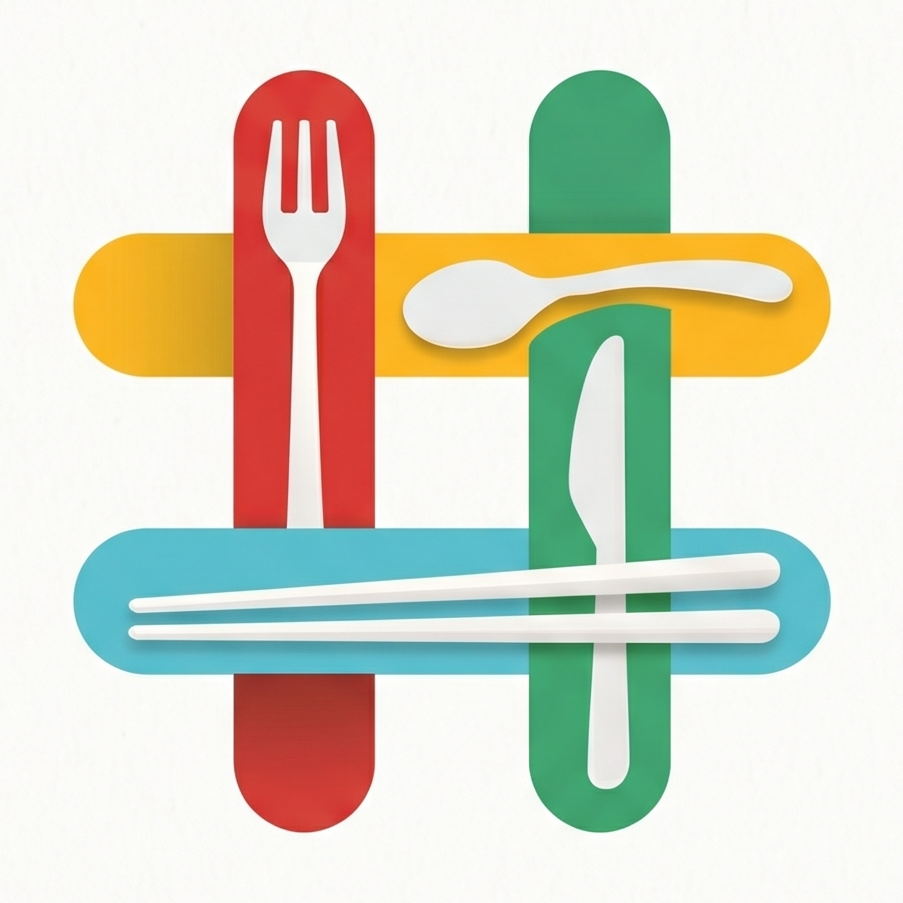
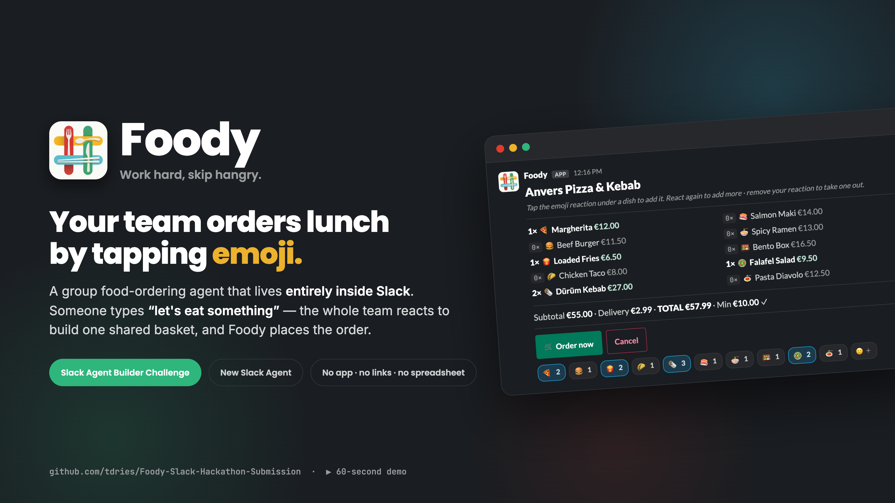

# Foody — Launch Kit

### *Work hard, skip hangry.*

**Group food ordering, by emoji — a Slack agent that takes your team from hungry to ordered without leaving the channel.**

🎬 **[Watch the 60-second demo](https://www.youtube.com/watch?v=TJ0aVqwF8wQ)**  ·  💻 **[Source](https://github.com/tdries/Foody-Slack-Hackathon-Submission)**  ·  🏆 Slack Agent Builder Challenge · *New Slack Agent*

---

## 👋 Start here (for jury / reviewers)

> **What it is:** Someone types **“let's eat something”** in Slack. The whole team taps **emoji reactions** to build one shared basket, and Foody places the order on **Just Eat Takeaway.com** — no app, no links, no spreadsheet.

The fastest way to understand the product, in order:

1. **▶ [Watch the demo](https://www.youtube.com/watch?v=TJ0aVqwF8wQ)** (60 seconds) — `video/Foody-Demo-Video.mp4`
2. **📊 [Pitch deck](decks/Foody-Pitch-Deck.pdf)** (7 slides) — problem → solution → how it works → impact
3. **📄 [Commercial one-pager](pdf/Foody-One-Pager.pdf)** — the product at a glance

---

## 📦 What's in this kit

| Folder | Contents |
|---|---|
| 🎬 **[video/](video/)** | `Foody-Demo-Video.mp4` (narrated 60-sec demo) · `Foody-Demo.gif` (silent loop) |
| 📊 **[decks/](decks/)** | `Foody-Pitch-Deck.pdf` — 7-slide 16:9 pitch deck |
| 📄 **[pdf/](pdf/)** | Commercial, Technical, How-To and Deploy one-pagers |
| 📐 **[diagrams/](diagrams/)** | Architecture sequence diagrams — *today* vs *with the official API* (PDF + PNG) |
| 🖼️ **[images/](images/)** | `hero-cover.png` · `social-og.png` (1200×630 share card) · `screenshots/` (6 in-app shots) · logo files |
| ✍️ **[copy/](copy/)** | LinkedIn post · YouTube description · messaging kit · voiceover script |
| 🎨 **[brand/](brand/)** | `foody-logo.png` (full lockup) · `foody-mark.png` (icon) |

### PDFs in detail
| File | For |
|---|---|
| [pdf/Foody-One-Pager.pdf](pdf/Foody-One-Pager.pdf) | The "why it matters" pitch on one page |
| [pdf/Foody-Technical-One-Pager.pdf](pdf/Foody-Technical-One-Pager.pdf) | Architecture & engineering overview |
| [pdf/Foody-How-To-One-Pager.pdf](pdf/Foody-How-To-One-Pager.pdf) | How a team uses it, in 6 steps |
| [pdf/Foody-Deploy-One-Pager.pdf](pdf/Foody-Deploy-One-Pager.pdf) | Self-host it in your own workspace (~5 min) |

---

## ✨ Why Foody is different

- 🪄 **The interface is just emoji** — group ordering with zero new UI.
- 🧭 **A self-healing basket** — reconciled from the *actual* reactions on the message, so a dropped Slack event never desyncs the cart.
- ⚙️ **Deterministic by design** — no LLM in the runtime path; same input, same result, every time.
- 🔌 **Private by default** — runs over Slack Socket Mode; no public URL, nothing leaves the workspace.

---

## 🔗 Quick links

- **Demo video:** https://www.youtube.com/watch?v=TJ0aVqwF8wQ
- **Source code:** https://github.com/tdries/Foody-Slack-Hackathon-Submission
- **Full story (Devpost write-up):** [DEVPOST.md](DEVPOST.md)

 

**Foody** · group food ordering for Slack · *Work hard, skip hangry.* 🍴

